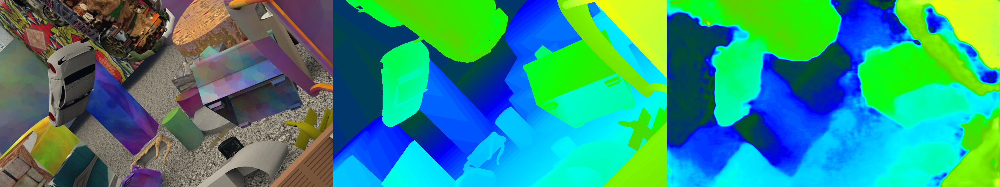

# Overview
This repository contains parts of my master's thesis on the topic "Dense Depth Estimation in Stereo Endoscopy". The code only features a reduced version of the model and lacks all the preprocessing tools used to process the endoscopic image data. 

Given a set of image pairs and corresponding disparity maps, this code lets a deep learning model learn to predict disparity maps from stereo image pairs. 
To anyone interested in using this repository, I recommend starting with the SceneFlow or the KITTI datasets. 

Here an example of an image, ground truth disparity map and predicted disparity map of a model which is being trained: 

A more detailed description might follow in the future. 

